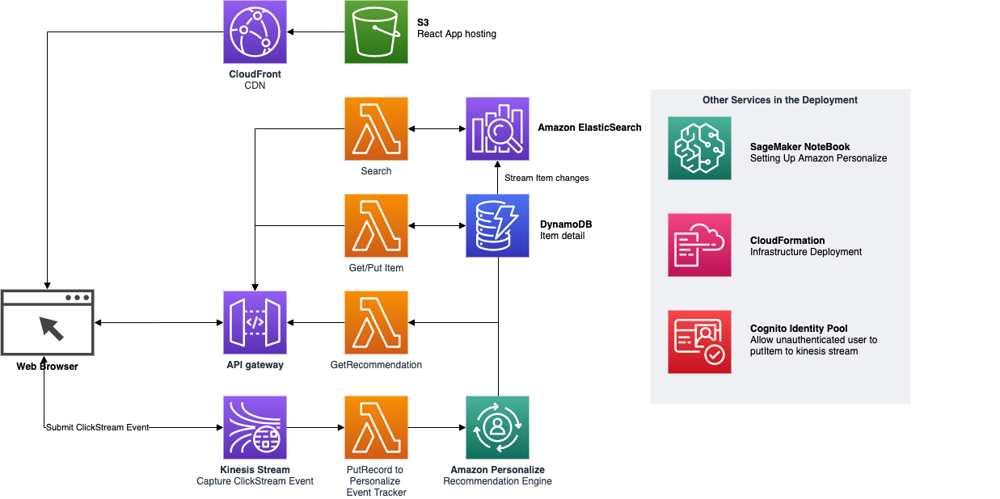

# "AllStore" Amazon Personalize Demo

A demo solution (and associated workshop Python notebooks in SageMaker) for product recommendations with 
[Amazon Personalize](https://aws.amazon.com/personalize/).

* See https://allstore.cloud/ for a running version, or
* Deploy the stack in your own account with the button below, or
* Read on to customize and build the components from source!

[](https://us-east-1.console.aws.amazon.com/cloudformation/home#/stacks/new?stackName=AllStoreDemo&templateURL=https://public-personalize-demo-assets-us-east-1.s3.amazonaws.com/package.yaml)

## Solution Architecture



## Initial Setup

### About the Data

This demo is based on minimally pre-processed (to reduce size) **Per-category product review data** as used in:

**"Justifying recommendations using distantly-labeled reviews and fined-grained aspects"**<br/>
*Jianmo Ni, Jiacheng Li, Julian McAuley*<br/>
*Empirical Methods in Natural Language Processing (EMNLP), 2019*

...and published [online here](https://nijianmo.github.io/amazon/index.html). This research was done (and previous version of the dataset [published](http://jmcauley.ucsd.edu/data/amazon/)) at the University of California San Diego; so we'll often refer to it as the "UCSD Dataset" in short.

In particular we use the UCSD-generated 5-core review subsets (removing mentions of any users or items with fewer than 5 reviews each), and our pre-processing filters the *product metadata* down to match this set, plus an additional 1% of "cold start" items. The actual data format is left unchanged - we're just trying to reduce the volume fed in to the solution and so the waiting times and service costs!

More details of the pre-processing procedure are available in [Personalize/util/UCSD Preprocessing.ipynb](Personalize/util/UCSD%20Preprocessing.ipynb)

### CloudFormation Template Parameter Guidance

* **ProjectName:** Used to name generated resources - many of which have more strict requirements than we could just use 'stack name' for
* **ProductSource:** List of products/items with metadata - see below for a list of available pre-processed item datasets
* **UserSource:** Small list of "interesting" users to display as login options in the demo - see below for a list of available pre-prepared user sets
* **InteractionSource:** Interactions (i.e. reviews) data - see below for a list of datasets we've already loaded to S3 and tested with the solution
* **WebSource:** Location of the web client source assets (you can probably leave this as default unless you know why you're changing it)
* **ExistingBaseCampaignName, ExistingSearchCampaignName, ExistingSimsCampaignName and ExistingTrackingId:** If you're following the demo through from scratch you'll be creating Amazon Personalize models/campaigns/etc. from the notebooks after the stack is set up - so can leave all these blank.

The following list of datasets have been pre-processed and checked with the solution already. Copy the link targets to save the S3 URI:

**us-east-1 (N. Virginia)**
| **Category** | **Review Data (Loaded to S3)** | **Item Data (Filtered)** | **Users (Manually Curated)** |
|-|-|-|-|
| **Clothing, Shoes and Jewelry** | `s3://public-personalize-demo-assets-us-east-1/data/Clothing_Shoes_and_Jewelry_5.json.gz` | `s3://public-personalize-demo-assets-us-east-1/data/meta_Clothing_Shoes_and_Jewelry_5.01.json.gz` |
| **Grocery and Gourmet Food** | `s3://public-personalize-demo-assets-us-east-1/data/Grocery_and_Gourmet_Food_5.json.gz` | `s3://public-personalize-demo-assets-us-east-1/data/meta_Grocery_and_Gourmet_Food_5.01.json.gz` | `s3://public-personalize-demo-assets-us-east-1/data/users_Grocery_and_Gourmet_Food.json` |
| **Sports and Outdoors** (customized) | `s3://public-personalize-demo-assets-us-east-1/data/Sports_and_Outdoors_Interactions-CSV.csv` | `s3://public-personalize-demo-assets-us-east-1/data/items_w_Metadata.csv` | `s3://public-personalize-demo-assets-us-east-1/data/users_Sports_and_Outdoors.json` |


### Post-CloudFormation Setup

The CloudFormation stack deployment will automatically:

* Stand up the infrastructure for your website (per the architecture diagram) excluding any **Amazon Personalize** components.
* Load the provided product data from the file you specify into DynamoDB (and, since they're connected via a stream, update Elasticsearch too)
* Configure the user list on your website
* (If you provided existing campaign and tracking IDs) configure your website to use these

To follow through the guided steps to **create** Personalize models, then once the CloudFormation Stack is deployed you should:

* Find the created *Notebook Instance* in the [Amazon SageMaker console](https://console.aws.amazon.com/sagemaker/home?#/notebook-instances)
* Click "Open JupyterLab" to start working in it
* Navigate to the [Personalize/](Personalize) folder in the file tree on the left (this repository should already have been cloned into the notebook instance)
* Review the README in that folder and work through the notebooks


## Folder Structure

```Tree
├── Personalize                             [Guided notebooks for using Personalize]
│   └── util                                [Convenience package to simplify notebooks]
├── data                                    [Previous data repository - deprecated]
├── deploy.sh                               [From-source deployment script (full stack)]
├── deploy-webui.sh                         [UI-only deployment script (for UI updates)]
├── functions                               [Lambda functions repo]
│   ├── APIs                                [Website API Lamdba functions]
│   │   ├── GetItem                         [Get item details]
│   │   ├── GetItemDescription              [Get product description from Amz API]
│   │   ├── GetRecommendations              [Get recommended items for a user]
│   │   ├── GetRecommendationsByItem        [Get recommended items by item]
│   │   ├── ListItems                       [List available items]
│   │   ├── PostClickEvent                  [Notify the model of a click event]
│   │   ├── Search                          [Search for items by text]
│   │   ├── SearchRerank                    [Re-rank search results for the user]
│   │   └── Session                         [Initialise a session (return stack params)]
│   ├── setup                               [Custom CloudFormation setup (data loader)]
│   └── streaming                           [Data-streaming Lambda functions]
│       └── UpdateSearchCluster
├── template.yaml                           [SAM CloudFormation Template]
└── webui                                   [Web client (user interface) source]
```

## Custom Build Prerequisites

In order to build and deploy this stack, you'll need:

### Installed on your machine

1. [AWS CLI](https://docs.aws.amazon.com/cli/latest/userguide/cli-chap-install.html) pointed to your target account and region with `aws configure`
1. [AWS SAM CLI](https://docs.aws.amazon.com/serverless-application-model/latest/developerguide/serverless-sam-cli-install.html)
1. [Docker Desktop](https://www.docker.com/products/docker-desktop)
1. Tools to build the Web UI front end from source:
    * [NodeJS v12](https://nodejs.org/en/download/) (You may wish to install Node via the **Node Version Manager** for [Mac/Linux](https://github.com/nvm-sh/nvm#installing-and-updating) or [Windows](https://github.com/coreybutler/nvm-windows#node-version-manager-nvm-for-windows)).
    * If you see Web UI build errors relating to an incompatible version of [Python](https://www.python.org/), you may need to install additional versions of Python via [pyenv](https://github.com/pyenv/pyenv#simple-python-version-management-pyenv) (recommended), [conda](https://docs.conda.io/en/latest/), or any other Python environment management tool of your choice.
1. Some kind of emulator to process bash scripts, if you're using Windows... Good luck! 😔

### On the AWS cloud

1. Access (and [access keys](https://docs.aws.amazon.com/IAM/latest/UserGuide/id_credentials_access-keys.html)) to an AWS Account, with sufficient permissions to create all the required resources.
2. An S3 Bucket to package the source code to, in the same AWS region as you expect to deploy.
3. Created a service linked role for ES, as below in AWS CLI:

``` bash
aws iam create-service-linked-role \
--aws-service-name es.amazonaws.com \
--description "My service-linked role to Amazon ElasticSearch"
```

## Deployment from Source

### Step 1: Build and deploy the stack

Run the deployment script, with parameters as follows:

```bash
deploy.sh <s3bucketname> <stackname> <AWSprofile (optional)>
```

* `s3bucketname` - The S3 bucket you've already created, for storing built source code (Lambda functions, etc.)
* `stackname` - The name to give the CloudFormation Stack ⚠️ must be up to 12 lower case letters ⚠️
* `AWSprofile` (Optional) - The API profile name, otherwise SAM will use the default profile

This script will:

* Build the web front end assets (locally) from ReactJS source code
* Build required Lambda functions in Docker via AWS SAM, and upload these packages to your S3 bucket
* Deploy the solution stack CloudFormation template via AWS SAM
* Upload the web front end assets to the web hosting bucket created in the solution stack.

This may take up to and over an hour to complete, mostly on the deployment of infrastructure-intensive resources such as the ElasticSearch domain and CloudFront distribution.

### Step 2: Post-deployment setup

1. Goto [Personalize](/Personalize) to start Creating Campaign
2. Once the Campaign is deploy go to the following fuction
    * Rerank
    * GetRecommendations
    * GetRecommendationsByItem
3. In the environment section and replace the ARN with the one create from jupyter notebook.
4. Goto ``/webui/src/``, Open [confix.tsx](/webui/src/index.tsx) file and edit the following varible. These varible can be found in cloudformation output.
    * Apitree
    * AnonymousPoolId
    * StreamName

**Note:** Personalize SIMS solution will perform much better with HPO than as configured by default.

## Using Custom Datasets

Code around data interpretation is deliberately permissive, so if you have a differently-formatted dataset where both the product catalogue and the interaction history are:

- Single CSV, JSON, or compressed csv.gz / json.gz files
- With logical field names for item ID, user ID, timestamp, product image URL etc

...then parts of the solution may already work for you.

If you need to customize, the most relevant code sections are:

- [functions/setup](functions/setup) is the **recursing Lambda function** which **loads and transforms** the source products file into DynamoDB. It also copies items, users, and interactions data sources into the working bucket for the notebooks - but no processing applied for this step.
- [Personalize/util/dataformat.py](Personalize/util/dataformat.py) contains the **accessor functions** which the Personalize notebooks use to get the canonical attributes of objects (e.g. image URL of a product)
- [webui](webui), where presentation logic is a little less standardized and different components access the returned API models directly.

Key design considerations include:

- It's probably easier to map your product data to (close to) the existing DynamoDB structure, than require changes to the web UI and API layers too
- Although we use Lambda recursion to process big item catalogue files that can take longer than 15 minutes, products are still loaded in serial and the custom CloudFormation resource must still stabilize within an hour... So there are still limits to the amount of product data you'll be able to synchronously load on stack creation. If your dataset is too big, just load it after the stack is created by some other method instead!

## API

### /items/{id}

Get item by item id ([ASIN](https://www.amazon.com/gp/seller/asin-upc-isbn-info.html))

**HTTP GET**
```
https://${Apitree}/${StageName}/items/B00004NKIQ
```

**Response Example**
```json
{
    "asin": "B00004NKIQ",
    "genre": "[\"Crib\",\"Furniture\",\"Fence\"]",
    "imUrl": "http://ecx.images-amazon.com/images/I/515sDhGh5aL._SY300_.jpg",
    "title": "Franklin Sports Adjustable Soccer Rebounder (6-Feet by 4-Feet)"
}
```

### /recommendations

Get item recommendations anonymously

**HTTP GET**
```
https://${Apitree}/${StageName}/recommendations/
```

**Response Example**
```json
[{
    "asin": "B001T7QJ9O",
    "genre": "[\"Electronics\",\"Helmet\",\"Clothing\",\"Apparel\",\"Headphones\",\"Headset\"]",
    "imUrl": "http://ecx.images-amazon.com/images/I/41bcSICIjBL._SY300_.jpg",
    "title": "Howard Leight R-01526 Impact Sport Electronic Earmuff"
}, {
    "asin": "B001BQZSZ4",
    "genre": "[\"Electronics\",\"Camera\",\"Video Camera\"]",
    "imUrl": "http://ecx.images-amazon.com/images/I/51OME86be7L._SX300_.jpg",
    "title": "Leapers Golden Image 38mm Red/Green Dot Sight, Integral Weaver Mount (SCP-RD40RGW)"
},...]
```

### /recommendations/{userId}

Get personalize recommendations for userId

**HTTP GET**
```
https://${Apitree}/${StageName}/recommendations/${UserID}

https://${Apitree}/${StageName}/recommendations/A1L5P841VIO02V
```

**Response Example**
```json
[{
    "asin": "B001T7QJ9O",
    "genre": "[\"Electronics\",\"Helmet\",\"Clothing\",\"Apparel\",\"Headphones\",\"Headset\"]",
    "imUrl": "http://ecx.images-amazon.com/images/I/41bcSICIjBL._SY300_.jpg",
    "title": "Howard Leight R-01526 Impact Sport Electronic Earmuff"
}, {
    "asin": "B0000C50K3",
    "genre": "[\"Leash\",\"Strap\"]",
    "imUrl": "http://ecx.images-amazon.com/images/I/41xc49yiI5L._SY300_.jpg",
    "title": "Hoppe's BoreSnake Rifle Bore Cleaner (Choose Your Caliber)"
}, ...]
```

### /recommendationsitem/{itemId}

Get personalize recommendations base on item similarity

**HTTP GET**
```
https://${Apitree}/${StageName}/recommendationsitem/${ItemID}

https://${Apitree}/${StageName}/recommendationsitem/2094869245
```

**Response Example**
```json
[{
    "asin": "B0081O93N2",
    "genre": "[\"Lamp\",\"Flashlight\"]",
    "imUrl": "http://ecx.images-amazon.com/images/I/41IA6SXVimL._SX300_.jpg",
    "title": "NowAdvisor&reg;Q5 CREE 240 Lumen LED Bike Bicycle Headlight Torch"
}, {
    "asin": "B001V57KKG",
    "genre": "[\"Handle\"]",
    "imUrl": "http://ecx.images-amazon.com/images/I/412I0yDuapL._SX300_.jpg",
    "title": "Ventura Mudguard Set 26&quot;-28&quot;"
}, ...]
```

### /search?q={query}

Search for products by text query

⚠️ `query` cannot be null

**HTTP GET**
```
https://${Apitree}/${StageName}/search?q=${querytext}

https://${Apitree}/${StageName}/search?q=Gun
```

**Response Example**
```json
[{
    "asin": "B00004SQM9",
    "genre": "[\"Lock\",\"Combination Lock\"]",
    "imUrl": "http://ecx.images-amazon.com/images/I/518M0N71SGL._SX300_.jpg",
    "title": "Master Lock 94DSPT 3-Digit Combination Gun Lock"
}, {
    "asin": "B0000C5398",
    "genre": "[\"Seasoning\",\"Syrup\",\"Food\",\"Ketchup\"]",
    "imUrl": "http://ecx.images-amazon.com/images/I/31bsl%2B1DQPL._SX300_.jpg",
    "title": "Birchwood Casey Tru - Oil Gun Stock Finish"
}, ...]
```

### /search?q={query}&u={userid}

User-personalized for products by text query

⚠️ `query` cannot be null

**HTTP GET**
```
https://${Apitree}/${StageName}/search?q=${querytext}&u=${UserID}

https://${Apitree}/${StageName}/search?q=Gun&u=A1L5P841VIO02V
```

**Response Example**
```json
[{
    "asin": "B0002INNYU",
    "genre": "[\"Gun\",\"Weapon\",\"Weaponry\",\"Handgun\"]",
    "imUrl": "http://ecx.images-amazon.com/images/I/41kOXbYLFKL._SX300_.jpg",
    "title": "Pearce Grips Gun Fits Government Model 1911 Rubber Finger Groove Insert"
}, {
    "asin": "B000P4YJC6",
    "genre": "[\"Vise\",\"Pump\",\"Gas Pump\",\"Machine\"]",
    "imUrl": "http://ecx.images-amazon.com/images/I/41H2beGGbZL._SY300_.jpg",
    "title": "Tipton Gun Vise"
}, ..]
```

### /session

Start a "session" (in reality, just fetching CloudFormation output params to configure the UI)

**HTTP GET**
```
https://${Apitree}/${StageName}/session
```

**Response Example**
```json
{
    "AnonymousPoolId": "us-east-1:c394e25c-63e8-4f39-9e62-123456ff123f",
    "StreamName": "allstore-Clickstream"
}
```
